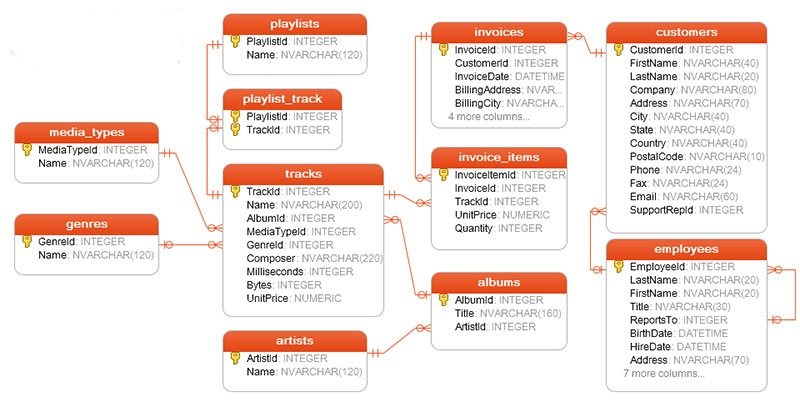

# SQL-Project
 Visualization of the Database🖼️
 

#####Overview🎵
In this project I mastered queries in SQL programming language.We used chinook database. You can see visual representation of the database above. With my team we retrieved , altered, grouped the data. The database is about a music company. You can analyze customers, staff, albums , etc. 

Check the code ➡️ <a href="https://github.com/BAVI-BOOP/SQL-projects/blob/main/chinook-data/main.sql">Queries</a>
 

